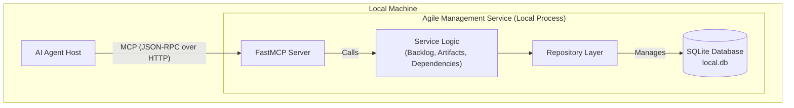

# Agile Lifecycle Management Service Architecture Document

## Introduction

This document outlines the overall project architecture for the Agile Lifecycle Management Service, including backend systems, shared services, and non-UI specific concerns. Its primary goal is to serve as the guiding architectural blueprint for AI-driven development, ensuring consistency and adherence to chosen patterns and technologies.

### Change Log

| Date | Version | Description | Author |
| :--- | :--- | :--- | :--- |
| 2025-07-26 | 1.0 | Initial architecture draft | Winston (Architect) |
| 2025-07-26 | 1.1 | Revised architecture for local hosting. | Winston (Architect) |
| 2025-07-26 | 1.2 | Added Tech Stack section. | Winston (Architect) |
| 2025-07-26 | 1.3 | Added Data Models section. | Winston (Architect) |
| 2025-07-26 | 1.4 | Refined architecture with 3-layer pattern and error handling. | Winston (Architect) |
| 2025-07-26 | 1.5 | Switched technology stack to Python. | Winston (Architect) |
| 2025-07-26 | 1.6 | Replaced FastAPI with FastMCP SDK and added implementation example. | Winston (Architect) |
| 2025-07-26 | 1.7 | Added examples for all MCP primitives (Tools, Resources, Prompts). | Winston (Architect) |

---

## High Level Architecture

### Technical Summary

The system will be implemented as a **single, monolithic service designed to be run and hosted locally**. This approach prioritizes simplicity and rapid development. The service will expose its functionality as a set of tools via the **FastMCP SDK**, which handles the underlying JSON-RPC and HTTP communication. All data will be managed in a local SQLite database for ease of setup and portability. This architecture provides a straightforward and efficient foundation for the AI agent toolkit.

### High Level Project Diagram



### **Architectural and Design Patterns**

* **Monolithic Service Architecture**: The entire service will be a single, deployable unit.
  * *Rationale*: For a locally hosted service, a monolith is simpler to develop, test, and run.
* **3-Layer Architecture**: The service will be strictly structured into three distinct layers to ensure separation of concerns.
  * **1. API/Tool Layer**: Implemented using the FastMCP SDK. This layer defines the tools available to the AI agent, validates parameters using type hints, and translates service layer exceptions into standard MCP errors.
  * **2. Service/Business Logic Layer**: This layer contains the core application logic (e.g., creating a story, checking dependencies). It is protocol-agnostic.
  * **3. Data Access/Repository Layer**: This layer handles all interactions with the SQLite database, abstracting the data source from the service layer.
* **Repository Pattern**: The Data Access Layer will implement the repository pattern.
  * *Rationale*: This decouples the business logic from the SQLite database implementation, making the system more testable.

## **Tech Stack**

This table defines the specific technologies and versions that will be used to build the service.

| Category | Technology | Version | Purpose | Rationale |
| :---- | :---- | :---- | :---- | :---- |
| **Language** | Python | \~3.11 | Primary development language | A robust, widely-used language with excellent support for web services and data handling. |
| **MCP SDK** | FastMCP | Latest | Handles MCP communication, tool definition, and the web server. | The official SDK for building MCP servers in Python. It simplifies development by handling protocol specifics automatically. |
| **Database** | SQLite | \~3.37+ | Local, file-based relational database | The simplest and most effective solution for a locally hosted service. No separate server process needed. |
| **ORM / DB Client** | SQLAlchemy | \~2.0 | Database toolkit and ORM | The de-facto standard for ORMs in Python, providing a powerful and flexible way to interact with the database. |
| **Testing** | Pytest | \~8.2.2 | Testing framework | A powerful and easy-to-use testing framework for Python, ideal for unit and integration tests. |

## **Data Models**

This section defines the core data entities for the service.

### **Epic**

* **Purpose**: Represents a large body of work or a major feature. It acts as a container for related user stories.
* **Key Attributes**:
  * id: string - Unique identifier.
  * title: string - The name of the epic.
  * description: string - A detailed explanation of the epic's goal.
  * status: string - The current state of the epic (e.g., Draft, Ready, In Progress, Done).
* **Relationships**:
  * Has many Stories.

### **Story**

* **Purpose**: Represents a single unit of work, such as a feature, bug fix, or task, from a user's perspective.
* **Key Attributes**:
  * id: string - Unique identifier.
  * title: string - A short, descriptive title.
  * description: string - The full user story text.
  * acceptanceCriteria: string[] - A list of conditions that must be met for the story to be considered complete.
  * status: string - The current state of the story (e.g., ToDo, InProgress, Review, Done).
* **Relationships**:
  * Belongs to one Epic.
  * Has many Artifacts linked to it.
  * Can have dependencies on many other Stories (prerequisites).
  * Can be a dependency for many other Stories.

### **Artifact**

* **Purpose**: Represents a link to a resource generated or used during development, such as a source code file, a design document, or an API specification.
* **Key Attributes**:
  * id: string - Unique identifier.
  * uri: string - The Uniform Resource Identifier for the artifact (e.g., file:///path/to/code.js).
  * relation: string - Describes the artifact's relationship to the story (e.g., implementation, design, test).
* **Relationships**:
  * Belongs to one Story.

## **Error Handling Strategy**

* **Custom Exceptions**: The Service Layer will define and use custom exceptions for specific business logic failures (e.g., StoryNotFoundError, CircularDependencyError).
* **Exception Translation**: The API/Tool Layer is responsible for catching these custom exceptions and translating them into standard MCP errors with appropriate codes (e.g., -32001) and messages before sending the response to the client. This keeps the core business logic clean and protocol-agnostic.

## **MCP Server Implementation Examples**

The following examples demonstrate how each of the three MCP primitives (Tools, Resources, and Prompts) will be defined in the API/Tool layer using the FastMCP SDK.

```python
# In src/agile_mcp/main.py
from mcp.server.fastmcp import FastMCP
from mcp.exceptions import McpError
from .services.story_service import StoryService
from .services.exceptions import StoryNotFoundError

# Create an instance of the FastMCP server
mcp = FastMCP("agile-service")
story_service = StoryService()

# 1. Tool Example (Model-Controlled)
# Tools are functions for the AI agent to execute actions.
@mcp.tool()
def get_story(story_id: str) -> dict:
    """
    Retrieves the full details for a single story by its unique ID.

    Args:
        story_id: The unique identifier for the story to retrieve.

    Returns:
        A dictionary containing the story's details.
    """
    try:
        story = story_service.get_story(story_id)
        return story.to_dict() # Assumes a serialization method
    except StoryNotFoundError as e:
        # Translate the internal service exception to a standard MCP error
        raise McpError(code=-32001, message=str(e), data={"story_id": story_id})

# 2. Resource Example (Application-Controlled)
# Resources expose contextual data that the host application can provide to the model.
# They are defined with a URI template.
@mcp.resource("agile://backlog")
def get_backlog() -> list[dict]:
    """
    Provides the current state of the entire project backlog.

    Returns:
        A list of all stories in the backlog.
    """
    all_stories = story_service.get_all_stories()
    return [story.to_summary_dict() for story in all_stories]

# 3. Prompt Example (User-Controlled)
# Prompts are templates that a human user can invoke, often via a UI element like a slash command.
@mcp.prompt()
def create_story_from_title(epic_id: str, title: str) -> dict:
    """
    Creates a new story with a given title within a specified epic.
    This is a user-facing command to quickly add a story to the backlog.

    Args:
        epic_id: The ID of the parent epic for the new story.
        title: The title for the new story.

    Returns:
        The newly created story object.
    """
    new_story = story_service.create_story(
        epic_id=epic_id,
        title=title,
        description="[Generated from prompt]",
        acceptance_criteria=[]
    )
    return new_story.to_dict()

# The main entry point will run the mcp server
if __name__ == "__main__":
     mcp.run()
```

---

## **Testing Strategy**

To ensure the reliability and correctness of the Agile Lifecycle Management Service, a multi-layered testing approach will be implemented using the **Pytest** framework. The strategy is designed to validate the service at the unit, integration, and end-to-end levels, accounting for the specifics of the MCP protocol and its transports.

### **1. Unit Tests**

*   **Scope**: Focus on individual functions and classes within the **Service Layer** and **Repository Layer**.
*   **Goal**: Verify that the core business logic (e.g., dependency validation, status transitions) and data access functions work correctly in isolation.
*   **Methodology**:
    *   The API/Tool layer will be mocked to isolate the service logic.
    *   The database will be mocked or an in-memory SQLite database will be used for repository tests to ensure speed and isolation.
    *   Tests will be located in `tests/unit`.

### **2. Integration Tests**

*   **Scope**: Test the interaction between the **Service Layer** and the **Repository Layer**.
*   **Goal**: Ensure that the business logic correctly interacts with the database via the repository pattern.
*   **Methodology**:
    *   Tests will use a dedicated, temporary SQLite database file to test real database operations without mocking the ORM.
    *   Each test will run in a transaction that is rolled back after completion to maintain a clean state.
    *   Tests will be located in `tests/integration`.

### **3. End-to-End (E2E) Tests**

*   **Scope**: Test the entire application stack, from the MCP transport layer down to the database.
*   **Goal**: Validate that the service behaves correctly from the perspective of an AI agent (MCP client), ensuring that JSON-RPC requests are handled properly and produce the correct responses and side effects.
*   **Methodology**:
    *   E2E tests will simulate an MCP client interacting with the running service.
    *   For the MVP, testing will focus exclusively on the **`stdio` transport**, as this is the primary communication method for locally hosted MCP servers.
    *   A `pytest` fixture will launch the server as a `subprocess`.
    *   The test will write JSON-RPC request strings to the subprocess's `stdin`.
    *   It will read from `stdout` to capture the JSON-RPC response and from `stderr` to check for logs.
    *   Tests will assert that `stdout` contains *only* the valid JSON-RPC response and that any logging output is correctly directed to `stderr`.
    *   Tests will be located in `tests/e2e`.
