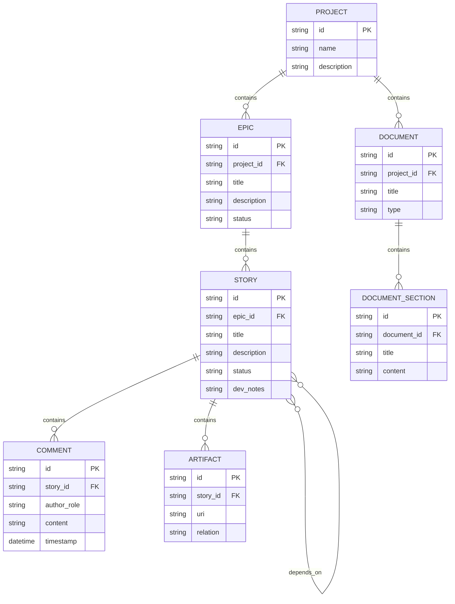

## **Data Models**

This section defines the core data entities for the service, reflecting a project-centric and context-aware architecture.

### Entity Relationship Diagram

### **Project**

*   **Purpose**: The top-level container for a distinct software initiative. It holds all associated epics, stories, and ingested documents.
*   **Key Attributes**:
    *   `id`: string - Unique identifier.
    *   `name`: string - The name of the project.
    *   `description`: string - A high-level description of the project's goals.
*   **Relationships**:
    *   Has many Epics.
    *   Has many Documents.

### **Epic**

*   **Purpose**: Represents a large body of work or a major feature. It acts as a container for related user stories.
*   **Key Attributes**:
    *   id: string - Unique identifier.
    *   title: string - The name of the epic.
    *   description: string - A detailed explanation of the epic's goal.
    *   status: string - The current state of the epic (e.g., Draft, Ready, In Progress, Done).
*   **Relationships**:
    *   Belongs to one Project.
    *   Has many Stories.

### **Story**

*   **Purpose**: Represents a single, self-sufficient unit of work for a Developer Agent. It contains all necessary context to be implemented without requiring further queries.
*   **Key Attributes**:
    *   `id`: string - Unique identifier.
    *   `title`: string - A short, descriptive title.
    *   `description`: string - The full user story text.
    *   `status`: string - The current state of the story (e.g., ToDo, InProgress, Review, Done).
    *   `acceptance_criteria`: list[string] - A list of precise, testable conditions.
    *   `dev_notes`: string (Markdown/JSON) - Pre-compiled context from the Scrum Master, including architectural guidance, tech stack, data models, and testing standards.
    *   `tasks`: list[dict] - A sequential checklist for the agent's implementation plan (e.g., `{'description': '...', 'completed': false}`).
*   **Relationships**:
    *   Belongs to one Epic.
    *   Has many Comments.
    *   Has many Artifacts linked to it.
    *   Can have dependencies on many other Stories.

### **Document** & **DocumentSection**

*   **Purpose**: To store and provide granular access to source-of-truth documents like PRDs and architecture guides.
*   **Key Attributes (`Document`)**:
    *   `id`: string - Unique identifier.
    *   `title`: string - The document's title (e.g., "PRD").
    *   `type`: string - The document's role (e.g., "Requirements", "Architecture").
*   **Key Attributes (`DocumentSection`)**:
    *   `id`: string - Unique identifier.
    *   `title`: string - The section's title, derived from a Markdown heading.
    *   `content`: string - The text content of the section.
*   **Relationships**:
    *   A `Document` belongs to one `Project`.
    *   A `Document` has many `DocumentSections`.

### **Comment**

*   **Purpose**: To enable a unified, threaded conversation between all agents and human reviewers on a story.
*   **Key Attributes**:
    *   `id`: string - Unique identifier.
    *   `author_role`: string (Enum) - The role of the commenter (e.g., `Developer Agent`, `QA Agent`, `Human Reviewer`).
    *   `content`: string - The text of the comment.
    *   `timestamp`: datetime - When the comment was created.
    *   `reply_to_id`: string (Optional) - The ID of the comment this is a reply to.
*   **Relationships**:
    *   Belongs to one Story.

### **Artifact**

*   **Purpose**: Represents a link to a resource generated or used during development, such as a source code file, a design document, or an API specification.
*   **Key Attributes**:
    *   id: string - Unique identifier.
    *   uri: string - The Uniform Resource Identifier for the artifact (e.g., file:///path/to/code.js).
    *   relation: string - Describes the artifact's relationship to the story (e.g., implementation, design, test).
*   **Relationships**:
    *   Belongs to one Story.
