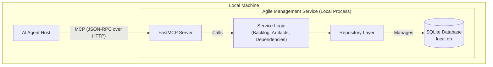

# High Level Architecture

## Technical Summary

The system will be implemented as a **single, monolithic service designed to be run and hosted locally**. This approach prioritizes simplicity and rapid development. The service will expose its functionality as a set of tools via the **FastMCP SDK**, which handles the underlying JSON-RPC and HTTP communication. All data will be managed in a local SQLite database for ease of setup and portability. This architecture provides a straightforward and efficient foundation for the AI agent toolkit.

## High Level Project Diagram

## **Architectural and Design Patterns**

* **Monolithic Service Architecture**: The entire service will be a single, deployable unit.
  * *Rationale*: For a locally hosted service, a monolith is simpler to develop, test, and run.
* **3-Layer Architecture**: The service will be strictly structured into three distinct layers to ensure separation of concerns.
  * **1. API/Tool Layer**: Implemented using the FastMCP SDK. This layer defines the tools available to the AI agent, validates parameters using type hints, and translates service layer exceptions into standard MCP errors.
  * **2. Service/Business Logic Layer**: This layer contains the core application logic (e.g., creating a story, checking dependencies). It is protocol-agnostic.
  * **3. Data Access/Repository Layer**: This layer handles all interactions with the SQLite database, abstracting the data source from the service layer.
* **Repository Pattern**: The Data Access Layer will implement the repository pattern.
  * *Rationale*: This decouples the business logic from the SQLite database implementation, making the system more testable.
