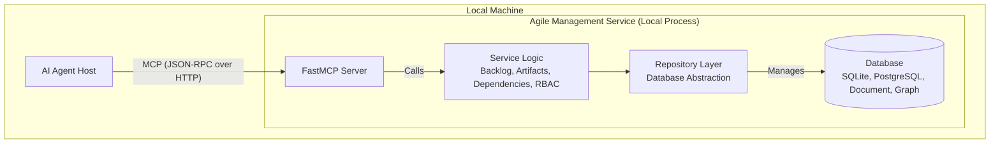

## High Level Architecture

### Technical Summary

The system will be implemented as a **single, monolithic service designed to be run and hosted locally**. This approach prioritizes simplicity and rapid development. The service will expose its functionality as a set of tools via the **FastMCP SDK**, which handles the underlying JSON-RPC and HTTP communication. Data will be managed through a flexible data access layer, initially using SQLite but designed to support various database technologies including relational (e.g., PostgreSQL), document-based (e.g., MongoDB), and graph databases (e.g., Neo4j). This architecture provides a straightforward and efficient foundation for the AI agent toolkit, with built-in extensibility for data persistence.

### High Level Project Diagram

### **Architectural and Design Patterns**

* **Monolithic Service Architecture**: The entire service will be a single, deployable unit.
  * *Rationale*: For a locally hosted service, a monolith is simpler to develop, test, and run.
* **3-Layer Architecture**: The service will be strictly structured into three distinct layers to ensure separation of concerns.
  * **1. API/Tool Layer**: Implemented using the FastMCP SDK. This layer defines the tools available to the AI agent, validates parameters using type hints, and translates service layer exceptions into standard MCP errors. It will also incorporate initial access control checks based on roles.
  * **2. Service/Business Logic Layer**: This layer contains the core application logic (e.g., creating a story, checking dependencies). It is protocol-agnostic and will enforce granular permissions based on the RBAC system.
  * **3. Data Access/Repository Layer**: This layer handles all interactions with the chosen database, abstracting the data source from the service layer. It is designed to support multiple database technologies.
* **Repository Pattern**: The Data Access Layer will implement the repository pattern.
  * *Rationale*: This decouples the business logic from the specific database implementation, making the system more testable and adaptable to different data stores (SQLite, PostgreSQL, Document, Graph).
* **Role-Based Access Control (RBAC)**: A dedicated RBAC system will be integrated across the API and Service layers.
  * *Rationale*: To ensure secure and appropriate interactions, different AI agent roles (e.g., Product Owner, Developer) will have distinct permissions for accessing tools and modifying data. This provides a robust security boundary for autonomous agent operations.

### **Development Workflow Enforcement Rules**

*   **Mandatory Feature Branching**: All development work **MUST** be performed on dedicated feature branches. Direct commits to the main branch are strictly prohibited and will be rejected by the CI/CD pipeline.
    *   *Rationale*: This enforces isolation of work in progress, prevents destabilizing the main branch, and ensures all changes are reviewed.
*   **Pull Request for Story Completion**: A story is only considered **DONE** when its associated feature branch has been merged into the main branch via a successfully reviewed and approved Pull Request (PR). Developers are **REQUIRED** to create a Pull Request for every story before marking it as complete.
    *   *Rationale*: This mandates that all code changes undergo necessary quality checks and team consensus before being integrated into the main codebase, ensuring traceability and accountability.
*   **Strict PR Quality Gates**: All Pull Requests **MUST** pass a series of automated quality gates before they can be merged. Failure to pass any of these gates will prevent the PR from being merged. These gates include:
    *   **Linting**: All code must adhere to established style guidelines and pass linting checks.
    *   **Static Analysis (Mypy)**: All type hints must be correct, and the codebase must pass `mypy` checks without errors.
    *   **Unit Tests**: All unit tests must pass.
    *   **Integration Tests**: All integration tests must pass.
    *   **End-to-End (E2E) Tests**: All E2E tests must pass.
    *   *Rationale*: These automated checks rigorously enforce code quality, correctness, and adherence to architectural standards, preventing regressions and maintaining a high-quality main branch.
