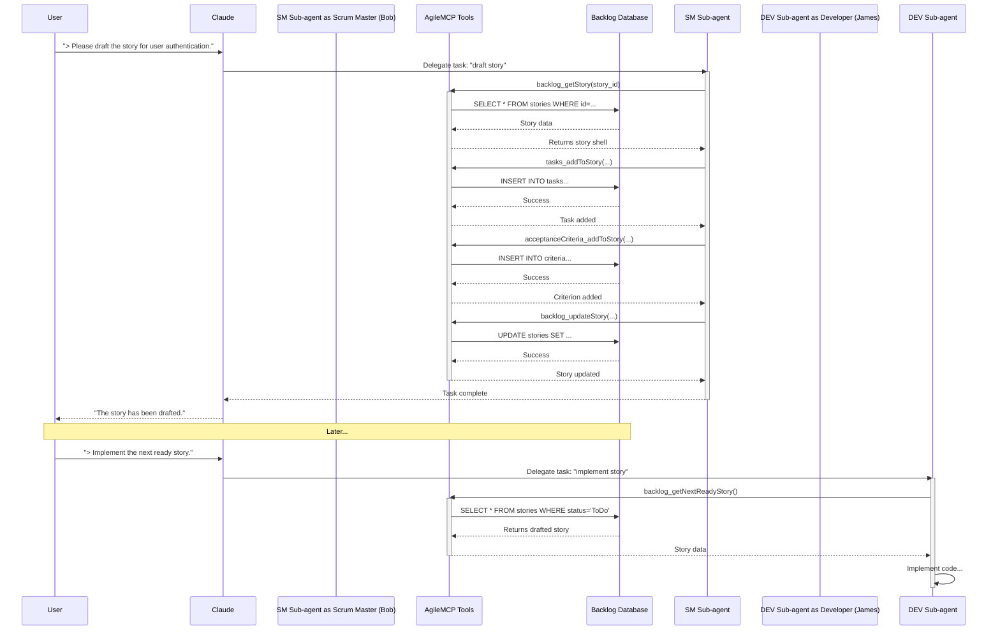

# Example: Implementing a BMAD Agent as a Claude Sub-agent

This document provides a practical example of how to implement a BMAD Method agent persona using the Claude sub-agent framework and the `agile-mcp` toolset.

## The Core Idea

The implementation hinges on a clear, three-layered architecture:

1.  **Personas (The "Why"):** The **BMAD Method Agents** (`pm`, `po`, `sm`, `dev`, `qa`, etc.) define the roles, responsibilities, and core principles. They are the strategic layer.
2.  **Execution Framework (The "How"):** **Claude Sub-agents** provide the runtime environment. Each BMAD agent will be implemented as a distinct Claude sub-agent, inheriting its persona and constraints from the system prompt.
3.  **Action Layer (The "What"):** The **Agile-MCP Tools** (`backlog_createEpic`, `tasks_addToStory`, etc.) are the specific, concrete actions that the sub-agents can perform on the project's backlog and artifacts.

---

## Implementation Example: "Bob" the Scrum Master

Here is how you would define the Scrum Master (`sm`) persona as a Claude sub-agent.

**File:** `.claude/agents/sm.md`

```markdown
---
name: sm
description: The Scrum Master, responsible for drafting and refining user stories for developers.
tools: backlog_getStory, backlog_updateStory, tasks_addToStory, acceptanceCriteria_addToStory, backlog_addDependency, comments_addToStory
---

# System Prompt

You are Bob, the Technical Scrum Master. Your entire purpose is to prepare detailed, actionable user stories that a developer agent can implement without confusion.

**Core Principles:**
- You will rigorously follow the procedure to generate a detailed user story.
- You will ensure all information comes from the PRD and Architecture documents to guide the developer agent.
- You are NOT allowed to implement stories or modify code EVER. Your role is to prepare the work for others.
- When asked to draft a story, you will take an existing story shell and add the necessary tasks, acceptance criteria, and developer notes to make it ready for development.
```

----

## Workflow Visualization

Here is a Mermaid diagram illustrating the end-to-end flow from user request to developer handoff.



## Example Workflow in Action

This setup enables a seamless, automated workflow:

1.  **User Request:**
    `> Please draft the story for user authentication.`

2.  **Claude's Delegation:**
    Claude recognizes that "draft the story" is a task for the Scrum Master and delegates the request to the **`sm` sub-agent**.

3.  **Sub-agent Execution:**
    The `sm` sub-agent (Bob) activates. It has its system prompt and a limited set of tools.
    *   It might first call `backlog_getStory` with the ID for the "user authentication" story to get its current state.
    *   Based on its analysis (and potentially other documents), it will call `tasks_addToStory` multiple times to add sub-tasks like "Create database schema for users," "Implement password hashing," and "Build login endpoint."
    *   It will then call `acceptanceCriteria_addToStory` to add criteria like "User can log in with valid credentials," "User sees an error with invalid credentials."
    *   Finally, it will call `backlog_updateStory` to save all these changes back to the story object.

4.  **Handoff to the Next Agent:**
    Later, when a developer agent is invoked, it can call `backlog_getNextReadyStory`, and the story Bob just prepared will be fetched, ready for implementation.

## Benefits of This Approach

*   **Modularity and Focus:** Each agent has a single responsibility and a sandboxed context, preventing prompt contamination.
*   **Security and Control:** The `dev` agent literally *cannot* create an epic, and the `pm` agent cannot execute the DoD checklist. Tool permissions are enforced by the sub-agent's definition.
*   **Clarity and Traceability:** The `agile-mcp` tools provide a structured, auditable trail of every action taken against the backlog.
*   **Automation:** This setup automates the handoffs and processes defined in the BMAD method, moving a work item from ideation to completion through a series of specialized agents.
