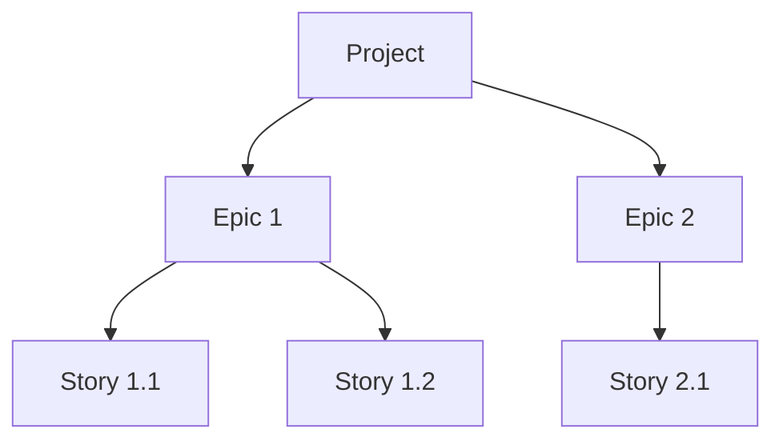

     Agile Service Design Decisions

This document captures the key design decisions and workflows for the AI-powered Agile Lifecycle Management Service.

1. Core Architecture

* Hosting Model: The service will be a single, monolithic application designed to be run and hosted locally. This prioritizes simplicity and rapid development.
* Layered Design: A strict 3-layer architecture will be used to ensure separation of concerns:
    1. API/Tool Layer: Handles all MCP communication using the FastMCP SDK.
    2. Service/Business Logic Layer: Contains the core, protocol-agnostic application logic.
    3. Data Access/Repository Layer: Manages all database interactions.

2. Technology Stack

The service will be built using a modern Python stack:
* Language: Python (~3.11)
* MCP SDK: FastMCP for handling all protocol and server logic.
* Database: SQLite for simple, local, file-based storage.
* ORM: SQLAlchemy for interacting with the database.
* Testing: Pytest.

3. Hierarchical Data & Database Model

Data Hierarchy

The service's data is organized in a clear hierarchy to ensure proper structure and traceability for all work items.
* Project: The top-level container for a distinct software initiative.
* Epic: A major feature or body of work within a Project.
* Story: A single, actionable unit of work within an Epic.
Code snippet

Database Architecture

* Primary Choice (Recommended): A Relational Database is the recommended approach. It excels at managing the structured, hierarchical nature of the data (Project -> Epic -> Story) and can efficiently handle the many-to-many dependency relationship between stories using a join table.
* Alternative (Future Consideration): A Hybrid Model using both a Relational DB and a Graph DB is a powerful pattern. The Relational DB would store the core data, while the Graph DB would specifically manage the complex dependency network. This adds complexity but could be considered in the future if dependency queries become a performance bottleneck.

4. Data & Context Management Strategy

Document Storage

To allow agents to query for specific context without loading entire files, documents will be stored in a structured database model:
* Document: Represents a high-level document (e.g., "PRD", "Architecture").
* DocumentSection: Represents a single, queryable section of a Document, corresponding to a Markdown heading.

Story Context

The workflow is designed for maximum efficiency for the Developer Agent:
* Primary Workflow: When a story is created, the Scrum Master (sm) agent pre-compiles all necessary context from the DocumentSections into the story's Dev Notes. The dev agent receives this self-contained packet of information all at once.
* Secondary Capability: The system supports on-demand retrieval of specific document or story sections (e.g., documents.getSection). This is used for corrective actions or specialized agent workflows.

Collaborative Notes & Comments

To enable collaboration between agents and humans, stories will have a structured commenting system:
* Unified Comment Stream: Each story will have a single list of comments, not separate sections for each role.
* Comment Model: Each comment will be an object with a specific structure:
    * author_role: (e.g., "Developer Agent", "QA Agent", "Human Reviewer")
    * content: The text of the note.
    * timestamp: When the note was added.
    * reply_to_id: (Optional) To allow for threaded conversations.

5. Agent Workflows & Imagined Tools

Phase 1: Project Initiation & Planning

* Roles: Analyst, Product Manager (pm), Architect
* Workflow: Generate foundational documents (Project Brief, PRD, Architecture).
* Key Tools:
    * projects.create(name, description)
    * backlog.createEpic(projectId, title, description)
    * documents.ingest(projectId, title, type, content): Parses and stores documents in the database.

Phase 2: Backlog Management & Story Creation

* Roles: Product Owner (po), Scrum Master (sm)
* Workflow: Organize the backlog and create self-contained stories.
* Key Tools:
    * PO: backlog.linkStoryDependency(...), backlog.updateEpicStatus(...)
    * SM: documents.getSection(...), backlog.createStory(...)

Phase 3: Development & Implementation

* Role: Developer Agent (dev)
* Workflow: Implement stories from the backlog.
* Key Tools:
    * backlog.getNextReadyStory(): The agent's starting point to get a task.
    * backlog.updateStoryStatus(...): To signal progress.
    * artifacts.linkToStory(...): To link code files to the story.
    * story.addComment(...): To add implementation notes and summaries.

Phase 4: Review & Collaboration

* Roles: QA Agent, Human Reviewer
* Workflow: Review the developer agent's work and provide feedback.
* Key Tools:
    * story.addComment(...): The central tool for providing feedback.
    * artifacts.listForStory(...): To retrieve files for review.
    * backlog.updateStoryStatus(...): To approve or reject the work.
