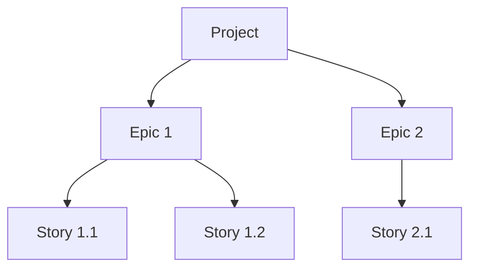

Of course. Here is the full, updated "Agile Service Design Decisions" document directly in the chat.

### **Agile Service Design Decisions**

This document captures the key design decisions for the AI-powered Agile Lifecycle Management Service.

-----

### **Core Architecture**

  * **Hosting Model**: The service will be a single, monolithic application designed to be run and hosted locally. This prioritizes simplicity and rapid development.
  * **Layered Design**: A strict 3-layer architecture will be used to ensure separation of concerns:
    1.  **API/Tool Layer**: Handles all MCP communication using the `FastMCP` SDK.
    2.  **Service/Business Logic Layer**: Contains the core, protocol-agnostic application logic.
    3.  **Data Access/Repository Layer**: Manages all database interactions.

-----

### **Technology Stack**

The service will be built using a modern Python stack:

  * **Language**: Python (\~3.11)
  * **MCP SDK**: `FastMCP` for handling all protocol and server logic.
  * **Database**: SQLite for simple, local, file-based storage.
  * **ORM**: SQLAlchemy for interacting with the database.
  * **Testing**: Pytest.

-----

### **Hierarchical Data & Database Model**

#### **Data Hierarchy**

The service's data is organized in a clear hierarchy to ensure proper structure and traceability for all work items.

  * **Project**: The top-level container for a distinct software initiative.
  * **Epic**: A major feature or body of work within a Project.
  * **Story**: A single, actionable unit of work within an Epic.

<!-- end list -->

#### **Database Architecture**

  * **Primary Choice (Recommended)**: A **Relational Database** is the recommended approach. It excels at managing the structured, hierarchical nature of the data (Project -\> Epic -\> Story) and can efficiently handle the many-to-many dependency relationship between stories using a join table.
  * **Alternative (Future Consideration)**: A **Hybrid Model** using both a Relational DB and a Graph DB is a powerful pattern. The Relational DB would store the core data, while the Graph DB would specifically manage the complex dependency network. This approach adds complexity but could be considered in the future if dependency queries become a performance bottleneck. The use of a Repository Pattern in the architecture makes such a future change feasible without rewriting business logic.

-----

### **Data & Context Management Strategy**

#### **Document Storage**

To allow agents to query for specific context without loading entire files, documents will be stored in a structured database model:

  * **`Document`**: Represents a high-level document (e.g., "PRD", "Architecture").
  * **`DocumentSection`**: Represents a single, queryable section of a `Document`, corresponding to a Markdown heading.

#### **Story Context**

The workflow is designed for maximum efficiency for the Developer Agent:

  * **Primary Workflow**: When a story is created, the **Scrum Master (`sm`)** agent pre-compiles all necessary context from the `DocumentSection`s into the story's `Dev Notes`. The `dev` agent receives this self-contained packet of information all at once.
  * **Secondary Capability**: The system supports on-demand retrieval of specific document or story sections (e.g., `documents.getSection`). This is used for corrective actions, specialized agent workflows (like a QA agent just needing acceptance criteria), or interactive debugging.

#### **Collaborative Notes**

To enable collaboration between agents and humans, stories will have a structured commenting system:

  * **Unified Comment Stream**: Each story will have a single list of comments, not separate sections for each role.
  * **`Comment` Model**: Each comment will be an object with a specific structure:
      * `author_role`: (e.g., "QA Agent", "Human Reviewer")
      * `content`: The text of the note.
      * `timestamp`: When the note was added.
      * `reply_to_id`: (Optional) To allow for threaded conversations.

-----

### **Detailed Story Model for Agent Interaction**

This section provides a complete breakdown of the `Story` object to ensure it is a self-sufficient packet of information for the Developer Agent.

#### **Core Attributes**

  * **`id`**, **`title`**, **`status`**, **`description`**: Standard fields to identify, name, and track the state and purpose of the story.
  * **`acceptanceCriteria`**: A list of precise, testable conditions that must be met for the story to be considered "Done."

#### **Context (`Dev Notes`)**

This is the most critical section for agent self-sufficiency. It is pre-compiled by the **Scrum Master (`sm`)** agent and contains all necessary context from the project's source-of-truth documents. Its structure includes:

  * **`Architectural Context`**: A summary of relevant patterns (e.g., 3-Layer Architecture) and coding standards the agent must follow.
  * **`Tech Stack`**: The specific libraries and versions to be used.
  * **`Source Tree`**: Snippets of the project structure to show where new files should go or existing files are located.
  * **`Data Models`** & **`API Contracts`**: Concrete definitions for data structures or endpoints the agent needs to use or create.
  * **`Testing Standards`**: Instructions on how to write tests for the new code.

#### **Task Management (`Tasks / Subtasks`)**

A sequential checklist that serves as the agent's step-by-step implementation plan.

#### **Collaboration (`Comments`)**

A list of `Comment` objects, each with an `author_role`, `content`, and `timestamp`, creating a unified, chronological conversation thread for reviews and notes.

#### **Traceability (`Artifacts`)**

A list of links to generated outputs (e.g., file URIs), connecting the story directly to its concrete results.
